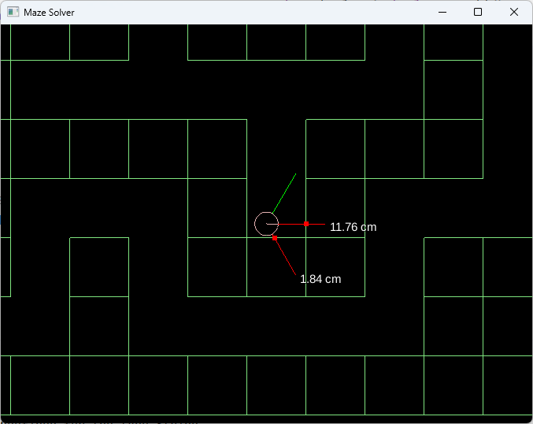

# LibGDX Maze Solver Simulation

This project is a maze solver robot simulation, which has three sensors around it.

# Run on Browser
You can run this example on your browser at:
https://ynsrc.github.io/libgdx-maze-solver/index.html

# Attributions
* https://github.com/libgdx/libgdx
* https://github.com/erincatto/box2d
* https://github.com/js42721/maze

# License
Apache 2.0 License
